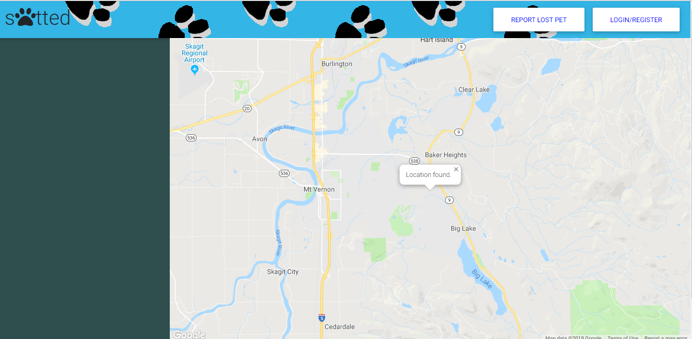

# sPAWtted

sPAWtted is an app designed to receive reports of missing pets and display them as markers on Google Maps.  

Overview

1. Reports of missing Cats and Dogs appear as markers on the Google Map screen, and are also listed on the side bar.
2. A user that wishes to make a report must first create an account.  Click on the "Login/Register" button, and then click on the Register section to create a User account.  Fill in all information and then click on "Sign Up".
3. A user can file a lost pet report by clicking on "Report Lost Pet".  Fill in as much information as possible and leave any additional comments in the text box at the bottom of the form.
4. By default the map will center in on your local area.  Lost Pet reports will appear throughout out the map based on the location entered in the "Street Address" field of the report form.
5. Click on any Lost Pet marker to view all of the report details.

## Getting Started

sPAWtted is deployed via Heroku.  A direct link for the Heroku can be found here: https://spawtted.herokuapp.com/

Files and other information can be found on GitHub here: https://github.com/devinpoore/sPawtted

If you wish to deploy locally, please see the Prerequisites and Installing sections below.  Otherwise, you can access the program from the Heroku link.

### Prerequisites

The data can be pulled directly from GitHub via GitBash on PC or via Terminal on Mac.  If you are new to this process, please follow the directions below:

When you have accessed the repository page on GitHub, you may simply download a Zip file and extract it to a directory of your choosing.  Alternatively, you may download the data directly to your device via GitBash if you have an SSH key.  More on adding an SSH key can be found here: https://help.github.com/en/enterprise/2.15/user/articles/adding-a-new-ssh-key-to-your-github-account

To download via GitBash, once you have a working SSH key with GitHub, create a folder you wish to download data into.  Next, click on the green 'Download or Clone' button on the GitHub respoitory page.  Make sure you have SSH key selected(and not HTTPS), and click on the clipboard icon.  This copies the address to your clipboard.

Next, navigate to the folder you wish to download the data into via GitBash or Terminal, and then simply type "git clone" followed by the link you copied onto your clipboard(paste via ctrl/cmd+v).  Press the enter key, and GitBash will pull the entire repository into your folder.

Additionally, you will need to have Node.js installed.  This can be done here: https://nodejs.org/en/

### Installing

Once you have the repository cloned, you will need to install a number of npm packages before you can begin using the program locally.  

Begin with adding a folder for node_modules by typing the following in the command line: npm init -y

Next you will need to install each package used for Friend Finder.  This can be done by typing each of the following into the command line:

* npm install
* npm install express
* npm install express-handlebars
* npm install mysql2
* npm install sequelize

It is also highly reccomended to have nodemon installed.  This is a global package which can be installed as follows:

* npm install -g nodemon

You will then need to build the spawtted_db database found on schema.sql.  This can be accomplished either through the MySQL Workbench or in the command console by typing: mysql -u root -p, and then entering your password when prompted.

In order to ensure the database will be connected correctly, you will need check the parameters in the connection.js file.  Make sure the port and password match with your localhost settings on MySQL Workbench.

Navigate to the folder location where the server.js found in the console.  Type "nodemon server.js" in the command line.  You should receive a message that it is now listening on port 3000.  If you wish to change this port, you will need to adjust this in the server.js file.

In your browser, navigate to localhost:3000(or whichever port you chose).  You should now see the main page for sPAWtted.

## Testing

HTML files can be validated here: https://validator.w3.org/#validate_by_input

The API & routing aspects of this program can be tested through use of the command console(GitBash/Terminal, etc.).  Simply add console.log under any section you wish to examine the results from in the console.

## Deployment

Navigate to https://github.com/ to clone.  Carefully follow the installation instructions above to deploy locally.

## Built With

Visual Studio Code: https://code.visualstudio.com/  
Node.js: https://nodejs.org/en/  
MySQL: https://www.mysql.com/  
Handlebars: https://handlebarsjs.com/  
Heroku: https://dashboard.heroku.com 

## Contributing

Feel free to fork the repository for your own study.  

## Versioning

Use github for version control (https://github.com/your/project/tags).

## In development

Additional features planned for future versions, including a "Sightings" report system to attach to missing pet reports.

## Authors

* **Devin Poore** - GoogleMaps, Node.js, JavaScript, API's
* **Monica Parente** - HTML/CSS, JavaScript
* **Everett Smith** - HTML/CSS
* **Joe Hutchinson** - Project Manager

## License

This project is not licensed.

## Acknowledgments

* Joe Rehfuss
* Trae Shanks
* Lan Truong

Thank you to our instructor & TA's.